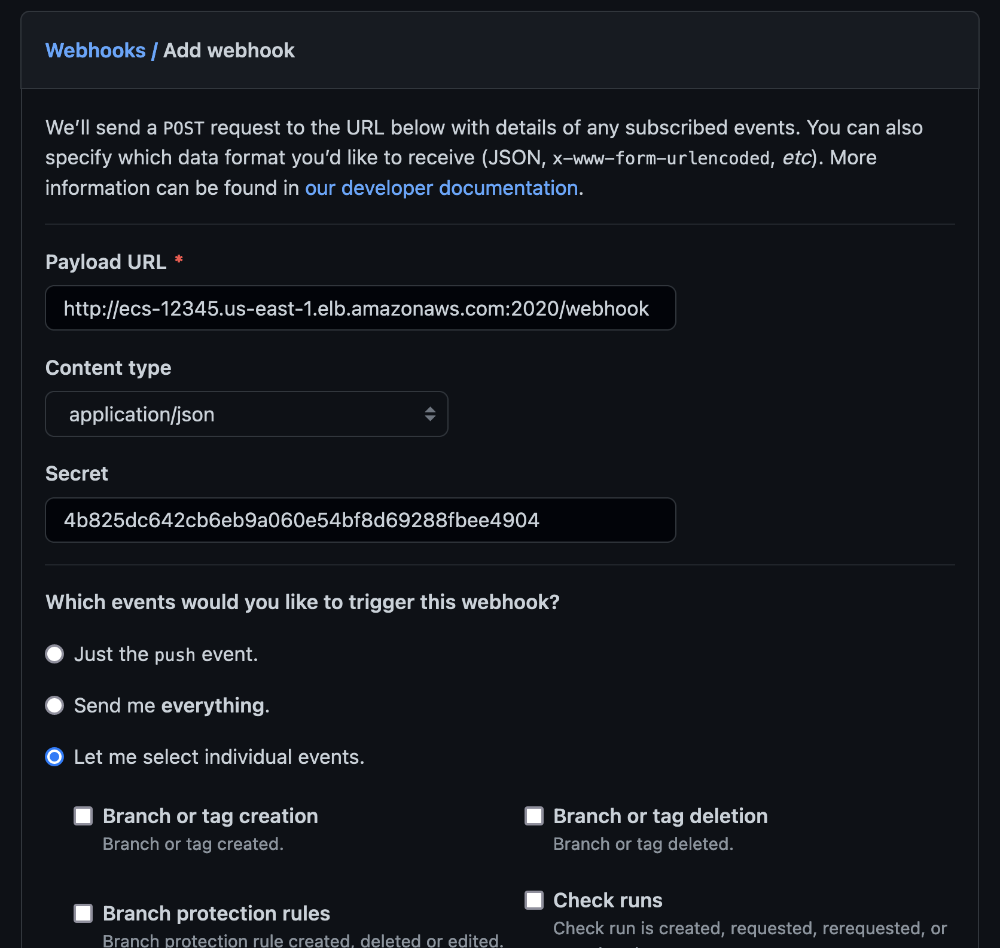
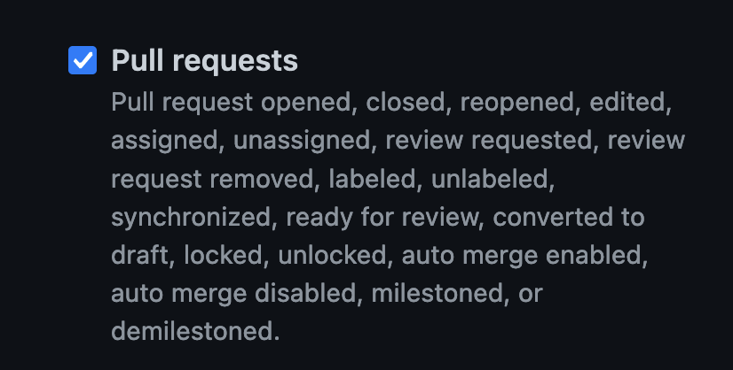

# Nodemon-Remote

<p align="center">
  
</p>

Drop-in replacement for [nodemon](https://nodemon.io/) with HTTP remote control and support for custom commands.

## How to use it

### Installation

```bash
npm install --save nodemon-remote
# or
npx nodemon-remote <nodemon cli arguments>
```

### Create a config: `.remoterc.js`

```js
module.exports = {
  port: 2020,
  access_key: "MY_SECRET_ACCESS_KEY",
  commands: {
    // Custom commands (arguments are always escaped)
    checkout: { cmd: "git checkout '${branch}'" },
    fetch: { cmd: "git fetch --all" },
    // Define multiple commands
    pullAndInstall: {
      cmd: [
        "git pull origin '${branch}'"
        "npm ci"
      ]
    },
  },
};
```

### Send nodemon restart command

```bash
curl -X POST \
  http://<endpoint>:2020/
  --header "Authorization: BEARER <MY_SECRET_ACCESS_KEY>" \
  --data '{ "cmd": "nodemon:restart" }'
```

Available build-in commands:

- `nodemon:restart`: Restart nodemon
- `nodemon:reset`: Resets all settings

### Send custom remote command

```bash
curl -X POST \
  http://<endpoint>:2020/
  --header "Authorization: BEARER <MY_SECRET_ACCESS_KEY>" \
  --data '{ "cmd": "checkout", "branch": "main" }'
```

### Github Webhook Integration

Trigger commands based on a configurable label:

```js
module.exports = {
  // ...
  webhook: {
    label: "preview",
    // Commands will run, if a PR with the label above is modified
    cmd: [
      "git fetch --all",
      "git checkout '${ref}'",
      "npm ci",
      "nodemon:restart",
    ],
  },
};
```

1. Got to webhook settings (`https://github.com/<org>/<project>/settings/hooks/new`)

2. Enter payload URL:

```
http://<endpoint>:2020/webhook
```

3. Select `application/json` and enter secret



4. Select `Let me select individual events.`

5. Enable `Pull requests` only



6. Hit `Add Webhook`

7. Assign label configured in `config.webhook.label` (e.g. `"preview"`) to PR
